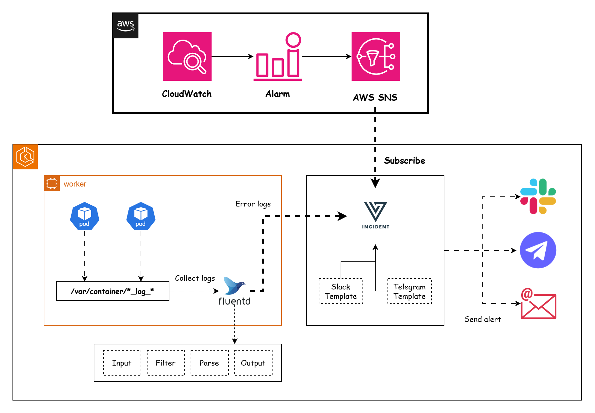

## Configuring Fluent Bit to Send Error Logs to Versus Incident



Fluent Bit is a lightweight log processor and forwarder that can filter, modify, and forward logs to various destinations. In this tutorial, we will configure Fluent Bit to filter logs containing [ERROR] and send them to the Versus Incident Management System using its REST API.

### Understand the Log Format

The log format provided is as follows, you can create a `sample.log` file:

```
[2023/01/22 09:46:49] [ INFO ] This is info logs 1
[2023/01/22 09:46:49] [ INFO ] This is info logs 2
[2023/01/22 09:46:49] [ INFO ] This is info logs 3
[2023/01/22 09:46:49] [ ERROR ] This is error logs
```

We are interested in filtering logs that contain `[ ERROR ]`.

### Configure Fluent Bit Filters

To filter and process logs, we use the `grep` and `modify` filters in Fluent Bit.

#### Filter Configuration

Add the following configuration to your Fluent Bit configuration file:

```ini
# Filter Section - Grep for ERROR logs
[FILTER]
    Name    grep
    Match   versus.*
    Regex   log .*\[.*ERROR.*\].*

# Filter Section - Modify fields
[FILTER]
    Name    modify
    Match   versus.*
    Rename  log Logs
    Set     ServiceName order-service
```

#### Explanation

1. **Grep Filter**:

- Matches all logs that contain `[ ERROR ]`.
- The `Regex` field uses a regular expression to identify logs with the `[ ERROR ]` keyword.

2. **Modify Filter**:

- Adds or modifies fields in the log record.
- Sets the `ServiceName` field for the default template. You can set the fields you want based on your template.

Default Telegram Template

```
🚨 <b>Critical Error Detected!</b> 🚨
📌 <b>Service:</b> {{.ServiceName}}
⚠️ <b>Error Details:</b>
{{.Logs}}
```

### Configure Fluent Bit Output

To send filtered logs to the Versus Incident Management System, we use the `http` output plugin.

#### Output Configuration

Add the following configuration to your Fluent Bit configuration file:

```ini
...
# Output Section - Send logs to Versus Incident via HTTP
[OUTPUT]
    Name    http
    Match   versus.*
    Host    localhost
    Port    3000
    URI     /api/incidents
    Format  json_stream
```

#### Explanation

1. **Name**: Specifies the output plugin (`http` in this case).
2. **Match**: Matches all logs processed by the previous filters.
3. **Host** and **Port**: Specify the host and port of the Versus Incident Management System (default is `localhost:3000`).
4. **URI**: Specifies the endpoint for creating incidents (`/api/incidents`).
5. **Format**: Ensures the payload is sent in **JSON Stream** format.

### Full Fluent Bit Configuration Example

Here is the complete Fluent Bit configuration file:

```ini
# Input Section
[INPUT]
    Name   tail
    Path   sample.log
    Tag    versus.*
    Mem_Buf_Limit 5MB
    Skip_Long_Lines On

# Filter Section - Grep for ERROR logs
[FILTER]
    Name    grep
    Match   versus.*
    Regex   log .*\[.*ERROR.*\].*

# Filter Section - Modify fields
[FILTER]
    Name    modify
    Match   versus.*
    Rename  log Logs
    Set     ServiceName order-service

# Output Section - Send logs to Versus Incident via HTTP
[OUTPUT]
    Name    http
    Match   versus.*
    Host    localhost
    Port    3000
    URI     /api/incidents
    Format  json_stream
```

### Test the Configuration

Run Versus Incident:

```
docker run -p 3000:3000 \
  -e TELEGRAM_ENABLE=true \
  -e TELEGRAM_BOT_TOKEN=your_token \
  -e TELEGRAM_CHAT_ID=your_channel \
  ghcr.io/versuscontrol/versus-incident
```

Run Fluent Bit with the configuration file:

```bash
fluent-bit -c /path/to/fluent-bit.conf
```

Check the logs in the Versus Incident Management System. You should see an incident created with the following details:

```
Raw Request Body: {"date":1738999456.96342,"Logs":"[2023/01/22 09:46:49] [ ERROR ] This is error logs","ServiceName":"order-service"}
2025/02/08 14:24:18 POST /api/incidents 201 127.0.0.1 Fluent-Bit
```

## Conclusion

By following the steps above, you can configure Fluent Bit to filter error logs and send them to the Versus Incident Management System. This integration enables automated incident management, ensuring that critical errors are promptly addressed by your DevOps team.

If you encounter any issues or have further questions, feel free to reach out!
